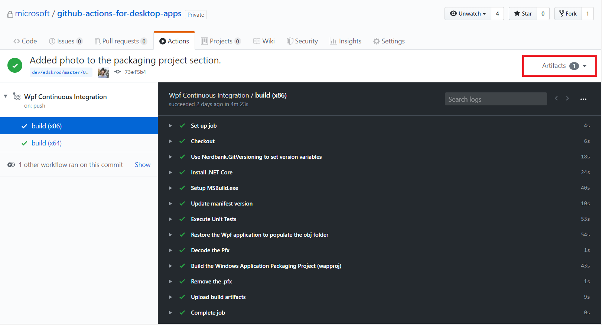
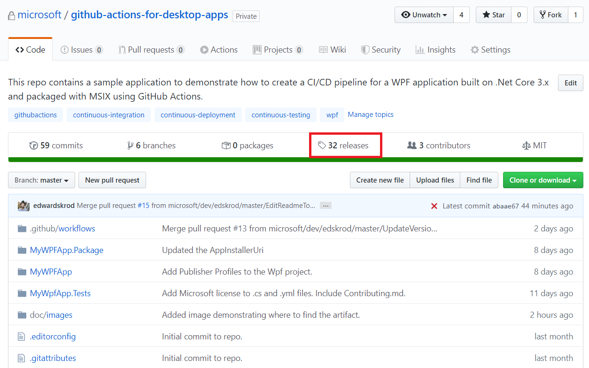
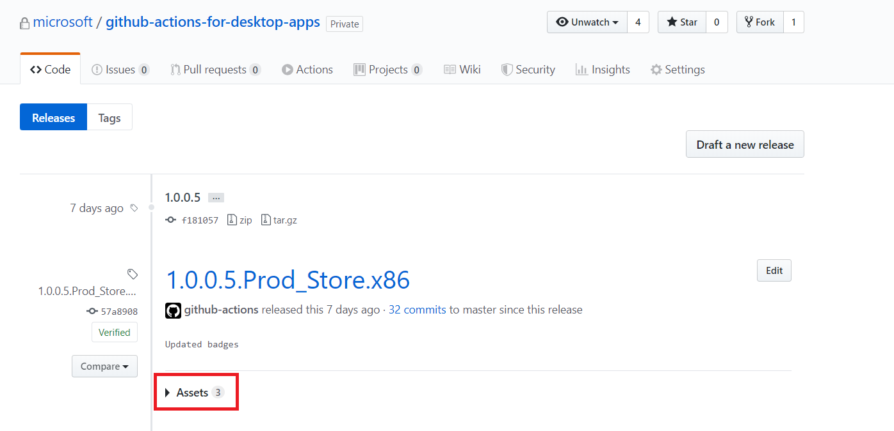
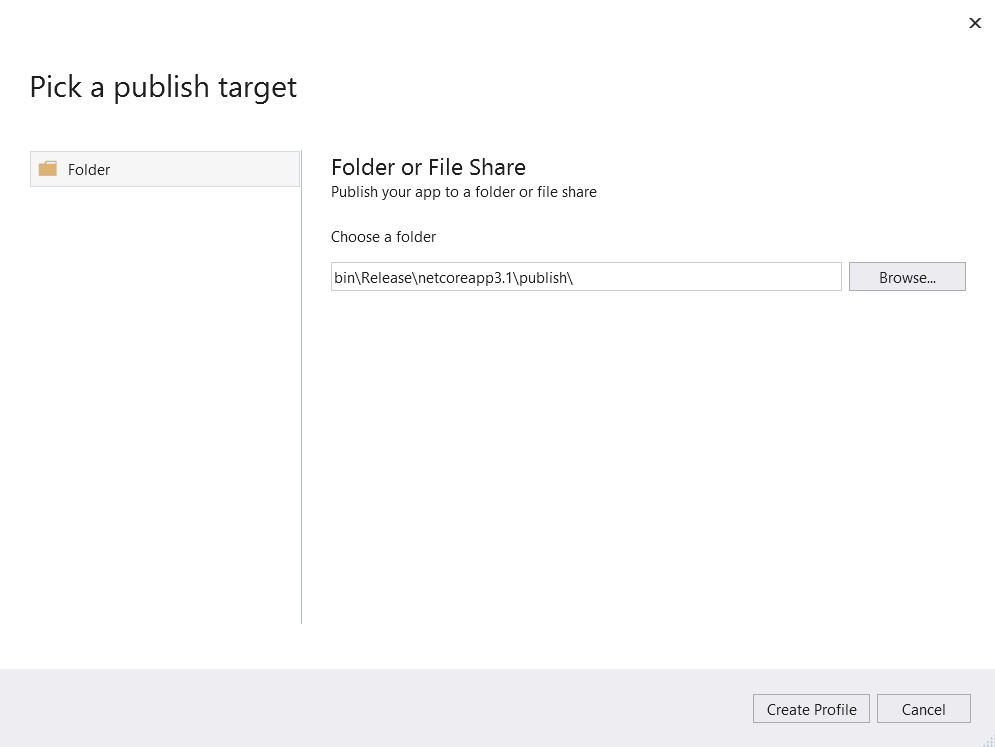
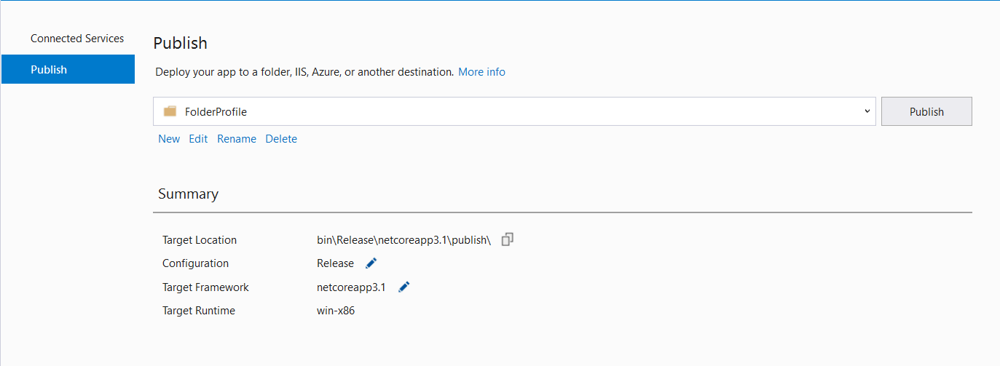
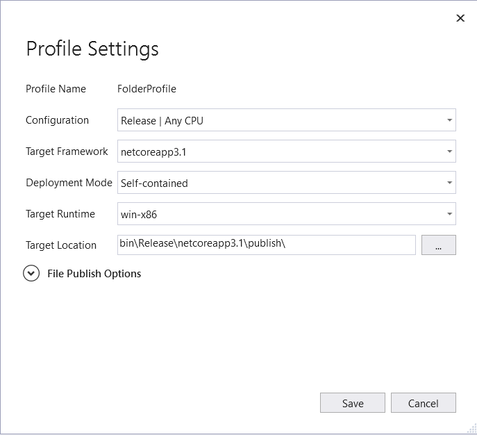
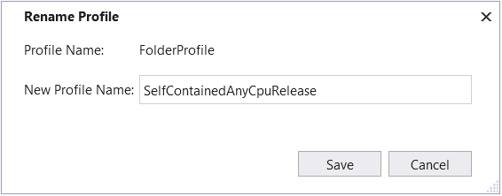
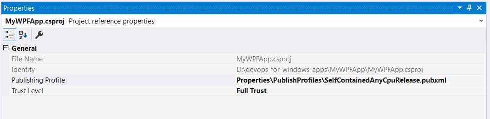
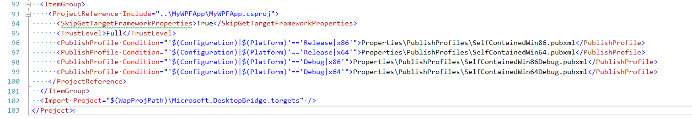

# DevOps for Windows Desktop Apps Using GitHub Actions

### Create CI/CD workflows for WPF and Windows Forms Applications built on .NET Core 3.x

This repo contains a sample application to demonstrate how to create CI/CD pipelines using [GitHub Actions](https://github.com/features/actions "GitHub Actions page"). 

With GitHub Actions, you can quickly and easily automate your software workflows with CI/CD.
* Integrate code changes directly into GitHub to speed up development cycles
* Trigger builds to quickly identify breaking changes and create testable debug builds
* Continuously run tests to identify and eliminate bugs, improving code quality 
* Automatically build, sign, package and deploy branches that pass CI 

Build, test, and deploy your code entirely within GitHub.

| Workflow | Status |
|----------|--------|
| WPF - CI |  |
| WPF - CD |  |
| WPF - CI (.NET 6 experimental) | [](https://github.com/microsoft/github-actions-for-desktop-apps/actions/workflows/ci-net6-temp.yml) |

## Workflows

To take advantage of GitHub Actions, workflows are defined in YAML files that are in the .github/workflows folder. 
In the project, there are two workflows defined:

* .github/workflows/ci.yml
* .github/workflows/cd.yml

The ci.yml file defines the continuous integration workflow which is used to build, test, and create a package every time a developer pushes code to the repo.

The benefits of kicking off a CI run on every push are multi-fold:
* Quickly identify breaking changes
* Create a testable debug build
* Continuously run tests to identify and eliminate bugs, improving code quality
* Keep workflow relatively lightweight by only testing configurations necessary to ensure good quality

The cd.yml file defines our continuous delivery workflow used to build, sign, package and archive release assets for every configuration that is planned for release.


### ci.yml: Build, test, package, and save package artifacts.

The CI workflow defines the Package.Identity.Name in the Windows Application Packaging project’s Package.appxmanifest to identify the application as "MyWPFApp.DevOpsDemo.Local." By suffixing the application name with ".Local," developers are able to install it side by side with other channels of the app.
```yaml
  <Identity
    Name="MyWPFApp.DevOpsDemo.Local"
    Publisher="CN=GitHubActionsDemo"
    Version="0.0.1.0" />
```

On every push to the repo, take advantage of the [setup-dotnet](https://github.com/actions/setup-dotnet "Setup dotnet GitHub Action") GitHub Action and install the [dotnet core cli](https://github.com/dotnet/cli "DotNet Core CLI page") environment. Then add [MSBuild](https://github.com/microsoft/setup-msbuild "MSBuild GitHub Action page") to the PATH and execute unit tests using the [dotnet test](https://docs.microsoft.com/en-us/dotnet/core/tools/dotnet-test "DotNet test page") runner console application.
```yaml
    - name: Install .NET Core
      uses: actions/setup-dotnet@v1
      with:
        dotnet-version: 3.1.100

    # Add  MsBuild to the PATH: https://github.com/microsoft/setup-msbuild
    - name: Setup MSBuild.exe
      uses: microsoft/setup-msbuild@v1.0.0
      
    # Test
    - name: Execute Unit Tests
      run: dotnet test $env:Test_Project_Path
```

As mentioned above, you can target multiple platforms by authoring the workflow file to define a build matrix, a set of different configurations that are each run in a fresh instance of a virtual environment by the [GitHub-hosted runner](https://help.github.com/en/actions/getting-started-with-github-actions/core-concepts-for-github-actions#github-hosted-runner "GitHub Hosted Runner page").

In the continuous integration workflow, create a release build for x86 and x64 that runs on the latest windows OS installed on the GitHub-hosted runners.  Then, define [environment variables](https://help.github.com/en/actions/configuring-and-managing-workflows/using-environment-variables "Configuring and Managing Workflows Using Environment Variables page") that are common to all the runs in the matrix such as the signing certificate name, the relative path to the solution file and the Windows Application Packaging project name.
```yaml
    strategy:
      matrix:
        targetplatform: [x86, x64]

    runs-on: windows-latest

    env:
      SigningCertificate: GitHubActionsDemo.pfx
      Solution_Path: MyWpfApp.sln
      Test_Project_Path: MyWpfApp.Tests\MyWpfApp.Tests.csproj
      Wpf_Project_Path: MyWpfApp\MyWpfApp.csproj
      Wap_Project_Directory: MyWpfApp.Package
      Wap_Project_Name: MyWpfApp.Package.wapproj
```

Next, execute the unit tests in MYWPFApp.Tests by calling ‘donet test’.
```yaml
    # Test
    - name: Execute Unit Tests
      run: dotnet test $env:Test_Project_Path
```

After executing the tests, restore the application while passing in the RuntimeIdentifier parameter in order to populate the obj folder with the appropriate platform dependencies for use during build.
```yaml
    # Restore the application
    - name:  Restore the Wpf application to populate the obj folder
      run: msbuild $env:Solution_Path /t:Restore /p:Configuration=$env:Configuration /p:RuntimeIdentifier=$env:RuntimeIdentifier
      env:
        Configuration: Debug
        RuntimeIdentifier: win-${{ matrix.targetplatform }}
```

Once the application has been restored, build and create the MSIX.  Rather than build each project separately, simply build the solution, making sure to pass the target platform, configuration, build mode, whether to produce an app bundle, the signing certificate, and certificate password as parameters.
```yaml
    # Build the Windows Application Packaging project
    - name: Build the Windows Application Packaging Project (wapproj) 
      run: msbuild $env:Solution_Path /p:Platform=$env:TargetPlatform /p:Configuration=$env:Configuration /p:UapAppxPackageBuildMode=$env:BuildMode /p:AppxBundle=$env:AppxBundle /p:PackageCertificateKeyFile=$env:SigningCertificate /p:PackageCertificatePassword=${{ secrets.Pfx_Key }}
      env:
        AppxBundle: Never
        BuildMode: SideLoadOnly
        Configuration: Release
        TargetPlatform: ${{ matrix.targetplatform }}
```

Once the app package has been created, take advantage of the [upload-artifact](https://github.com/marketplace/actions/upload-artifact "upload-artifact GitHub Action page") GitHub Action to save the artifact. You have the option to download the artifact to test the build or upload the artifact to a website or file share to distribute the application. 
```yaml
    # Upload the MSIX package: https://github.com/marketplace/actions/upload-artifact
    - name: Upload build artifacts
      uses: actions/upload-artifact@v1
      with:
        name: MSIX Package
        path: MyWpfApp.Package\AppPackages\
```

To find the artifact, navigate to "Actions," select the workflow, then download the artifact on the right side of the window.



### cd.yml: Build, package, and create a GitHub release for multiple channels

In the CD workflow, you can build, package and distribute code built for multiple channels such as “Dev”, “Prod_Sideload” and “Prod_Store.”  During every workflow run, the applications’ Package.Identity.Name, Package.Identity.Version and Package.Properties.DisplayName are changed according to which channel of the build matrix will be built.
We use a Powershell script to overwrite these values in the Windows Application Packaging project's Package.appxmanifest.  By doing so, we change the identity of the application to *MyWPFApp.DevOpsDemo.Dev*, *MyWPFApp.DevOpsDemo.ProdSideload*, or *MyWPFApp.DevOpsDemo.ProdStore* depending on which matrix channel is built, thus enabling multiple channels of the application.
```yaml
    # Update the appxmanifest before build by setting the per-channel values set in the matrix.
    - name: Update manifest version
      run: |
        [xml]$manifest = get-content ".\$env:Wap_Project_Directory\Package.appxmanifest"
        $manifest.Package.Identity.Version = "$env:NBGV_SimpleVersion.0"
        $manifest.Package.Identity.Name = "${{ matrix.MsixPackageId }}"
        $manifest.Package.Identity.Publisher = "${{ matrix.MsixPublisherId }}"
        $manifest.Package.Properties.DisplayName = "${{ matrix.MsixPackageDisplayName }}"
        $manifest.Package.Applications.Application.VisualElements.DisplayName = "${{ matrix.MsixPackageDisplayName }}"
        $manifest.save(".\$env:Wap_Project_Directory\Package.appxmanifest")
```

On every push to the repo with a tag matching the pattern *, the workflow will build the solution, create a release and upload the release asset. For more information on how to configure a workflow to run on specific branches or tags, see [GitHub Workflow syntax for GitHub Actions - on.<push | pull_request>.<branches | tags>](https://help.github.com/en/actions/reference/workflow-syntax-for-github-actions#onpushpull_requestbranchestags "GitHub Workflow Syntax for GitHub Actions").
```yaml
on: 
  push:
    tags:
      - '*'
```

To create a git `tag`, run the following commands on the branch you wish to release:
```cmd
git tag 1.0.0.0
git push origin --tags
```

The above commands will add the tag "1.0.0.0" and then `push` the branch and tag to the repo. Learn more about [Git Tagging.](https://git-scm.com/book/en/v2/Git-Basics-Tagging "Basics of Git Tagging")

Channels and environment variables used during the run are defined in the build matrix and will build and create app packages for development (Dev), production sideload (Prod_Sideload), and also production for the [Microsoft Store](https://www.microsoft.com/en-us/store/apps/windows "Microsoft Store home page") (Prod_Store). In this example, each channel is built for two configurations: x86 and x64.  However, arm or arm64 are valid configurations as well.

A build matrix can be created to execute jobs across multiple operating systems, build configurations or different supported versions of a programming language. With GitHub Actions, you can define incredibly complex build matrices that can generate up to 256 builds per run! Learn how to [configure a build matrix.](https://help.github.com/en/actions/configuring-and-managing-workflows/configuring-a-workflow#configuring-a-build-matrix "Learn how to configure a build matrix page")
```yaml
jobs:

  build:

    strategy:
      matrix:
        channel: [Dev, Prod_Sideload, Prod_Store]
        targetPlatform: [x86, x64]
        include:
          
          # includes the following variables for the matrix leg matching Dev
          - channel: Dev
            ChannelName: Dev
            Configuration: Debug
            DistributionUrl: https://microsoft.github.io/github-actions-for-desktop-apps-distribution-dev
            MsixPackageId: MyWPFApp.DevOpsDemo.Dev
            MsixPublisherId: CN=GitHubActionsDemo
            MsixPackageDisplayName: MyWPFApp (Dev)

          # includes the following variables for the matrix leg matching Prod_Sideload
          - channel: Prod_Sideload
            Configuration: Release
            ChannelName: Prod_Sideload
            DistributionUrl: https://microsoft.github.io/github-actions-for-desktop-apps-distribution-prod
            MsixPackageId: MyWPFApp.DevOpsDemo.ProdSideload
            MsixPublisherId: CN=GitHubActionsDemo
            MsixPackageDisplayName: MyWPFApp (ProdSideload)

          # includes the following variables for the matrix leg matching Prod_Store
          - channel: Prod_Store
            Configuration: Release
            ChannelName: Prod_Store
            DistributionUrl: 
            MsixPackageId: MyWPFApp.DevOpsDemo.ProdStore
            MsixPublisherId: CN=GitHubActionsDemo
            MsixPackageDisplayName: MyWPFApp (ProdStore)
```
Just like the CI workflow, restore the solution.
```yaml
    # Restore the application
    - name:  Restore the Wpf application to populate the obj folder
      run: msbuild $env:Solution_Path /t:Restore /p:Configuration=$env:Configuration /p:RuntimeIdentifier=$env:RuntimeIdentifier
      env:
        Configuration: Debug
        RuntimeIdentifier: win-${{ matrix.targetplatform }}
```

This time, however, use GitHub’s ```if``` conditional to build and package the MSIX for Dev and Prod_Sideload (which requires an AppInstaller Uri and Signing Certificate) or for Prod_Store. 
We pass different parameters depending on which channel we are building for.
```yaml
    # Build the Windows Application Packaging project for Dev and Prod_Sideload
    - name: Build the Windows Application Packaging Project (wapproj) for ${{ matrix.ChannelName }}
      run: msbuild $env:Solution_Path /p:Platform=$env:TargetPlatform /p:Configuration=$env:Configuration /p:UapAppxPackageBuildMode=$env:BuildMode /p:AppxBundle=$env:AppxBundle /p:PackageCertificateKeyFile=$env:SigningCertificate /p:PackageCertificatePassword=${{ secrets.Pfx_Key }}
      if: matrix.ChannelName != 'Prod_Store'
      env:
        AppxBundle: Never
        AppInstallerUri: ${{ matrix.DistributionUrl }}
        BuildMode: SideLoadOnly
        Configuration: ${{ matrix.Configuration }}
        GenerateAppInstallerFile: True
        TargetPlatform: ${{ matrix.targetplatform }}
        
    # Build the Windows Application Packaging project for Prod_Store
    - name: Build the Windows Application Packaging Project (wapproj) for ${{ matrix.ChannelName }}
      run: msbuild $env:Solution_Path /p:Platform=$env:TargetPlatform /p:Configuration=$env:Configuration /p:UapAppxPackageBuildMode=$env:BuildMode /p:AppxBundle=$env:AppxBundle /p:GenerateAppInstallerFile=$env:GenerateAppInstallerFile /p:AppxPackageSigningEnabled=$env:AppxPackageSigningEnabled
      if: matrix.ChannelName == 'Prod_Store'
      env:
        AppxBundle: Never
        AppxPackageSigningEnabled: False
        BuildMode: StoreOnly
        Configuration: ${{ matrix.Configuration }}
        GenerateAppInstallerFile: False
        TargetPlatform: ${{ matrix.targetplatform }}
```

Once the MSIX is created for each channel, the agent archives the AppPackages folder then creates a Release with the specified git release tag. The archive is uploaded to the release as an asset for storage or distribution. 
It’s important to note that release names must be unique or an error will be generated.  This is why tag_name and release_name include the github reference, channel name and target platform.
```yaml
    # Create the release:  https://github.com/actions/create-release
    - name: Create release
      id: create_release
      uses: actions/create-release@v1
      env:
        GITHUB_TOKEN: ${{ secrets.GITHUB_TOKEN }} # This token is provided by Actions, you do not need to create your own token
      with:
        tag_name: ${{ github.ref}}.${{matrix.ChannelName}}.${{ matrix.targetplatform }}
        release_name:  ${{ github.ref }}.${{ matrix.ChannelName }}.${{ matrix.targetplatform }}
        draft: false
        prerelease: false

    # Upload release asset:   https://github.com/actions/upload-release-asset
    - name: Update release asset
      id: upload-release-asset
      uses: actions/upload-release-asset@v1
      env:
        GITHUB_TOKEN: ${{ secrets.GITHUB_TOKEN }}
      with:
        upload_url: ${{ steps.create_release.outputs.upload_url }}  # This pulls from the CREATE RELEASE step above, referencing it's ID to get its outputs object, which include a `upload_url`. See this blog post for more info: https://jasonet.co/posts/new-features-of-github-actions/#passing-data-to-future-steps 
        asset_path: MyWpfApp.Package\AppPackages\AppPackages.zip
        asset_name: AppPackages.zip
        asset_content_type: application/zip

```

To find the Release artifacts, navigate to the "Releases" link in the repo.


Find the release and asset location.


Creating channels for the application is a powerful way to create multiple distributions of an application in the same CD pipeline.


### Versioning

In both workflows, one of the first things to do is create a version and store version information as environment variables.  Having a different version for every push is especially important when a release is created as each release must have a unique release_name.

The [Nerdbank.GitVersioning GitHub Action](https://github.com/AArnott/nbgv "Nerbank.GitVersioning GitHub Action page") sets the build version based on a combination of the included version.json file, and the git height of the version. 
```yaml
    # Use Nerdbank.GitVersioning to set version variables: https://github.com/AArnott/nbgv
    - name: Use Nerdbank.GitVersioning to set version variables
      uses: aarnott/nbgv@v0.3
      with:
        setAllVars: true
 ```

 Once the action runs, a number of environment variables are available for use, such as:
* NBGV_Version (e.g. 1.1.159.47562)
* NBGV_SimpleVersion (e.g. 1.1.159)
* NBGV_NuGetPackageVersion (e.g. 1.1.159-gcab9873dd7)
* NBGV_ChocolateyPackageVersion 
* NBGV_NpmPackageVersion

A list of all the environment variables available to use in the run are shown below.


See the [Nerdbank.GitVersioning](https://github.com/aarnott/nerdbank.gitversioning "Nerdbank.GitVersioning page") package for more information.


### Signing
Avoid submitting certificates to the repo if at all possible to ensure security best practices. (Git ignores them by default.) To manage the safe handling of sensitive files like certificates, take advantage of [GitHub secrets](https://help.github.com/en/actions/automating-your-workflow-with-github-actions/creating-and-using-encrypted-secrets "GitHub Secrets page"), which allow the storage of sensitive information in the repository.

First, generate a signing certificate in the Windows Application Packaging Project or add an existing signing certificate to the project.  Next, use PowerShell to encode the .pfx file using Base64 encoding by running the following Powershell script to generate the output file.
```pwsh
$pfx_cert = Get-Content '.\GitHubActionsDemo.pfx' -Encoding Byte
[System.Convert]::ToBase64String($pfx_cert) | Out-File 'SigningCertificate_Encoded.txt'
```

Open the output file, *SigningCertificate_Encoded.txt*, and copy the string inside.  Finally, add the string to the repo as a GitHub secret and name it Base64_Encoded_Pfx. [Learn how to add a secret to the workflow.](https://help.github.com/en/actions/automating-your-workflow-with-github-actions/virtual-environments-for-github-hosted-runners#creating-and-using-secrets-encrypted-variables "Creating and using secrets page")
In the workflow, add a step to decode the secret, save the .pfx to the build agent, and package the application with the Windows Application Packaging project.
```yaml
    # Decode the Base64 encoded Pfx
    - name: Decode the Pfx
      run: |
        $pfx_cert_byte = [System.Convert]::FromBase64String("${{ secrets.Base64_Encoded_Pfx }}")
        $currentDirectory = Get-Location
        $certificatePath = Join-Path -Path $currentDirectory -ChildPath $env:Wap_Project_Directory -AdditionalChildPath $env:SigningCertificate
        [IO.File]::WriteAllBytes("$certificatePath", $pfx_cert_byte)
```

Once the certificate is decoded and saved to the Windows Application Packaging Project, use it to sign the package during packaging making sure to pass the signing certificate's password, stored as a GitHub secret, to MSBuild as a parameter.
```yaml
    # Build the Windows Application Packaging project for Dev and Prod_Sideload
    - name: Build the Windows Application Packaging Project (wapproj) for ${{ matrix.ChannelName }}
      run: msbuild $env:Wap_Project_Directory/$env:Wap_Project_Name /p:Platform=$env:TargetPlatform /p:Configuration=$env:Configuration /p:UapAppxPackageBuildMode=$env:BuildMode /p:GenerateAppInstallerFile=$env:GenerateAppInstallerFile /p:AppInstallerUri=$env:AppInstallerUri /p:PackageCertificateKeyFile=$env:SigningCertificate /p:PackageCertificatePassword=${{ secrets.Pfx_Key }}
      if: ${{ matrix.ChannelName }} != Prod_Store
      env:
        AppInstallerUri: ${{ matrix.DistributionUrl }}
        BuildMode: SideLoadOnly
        Configuration: ${{ matrix.Configuration }}
        GenerateAppInstallerFile: True
        TargetPlatform: ${{ matrix.TargetPlatform }}
```

Finally, to ensure the certificate doesn’t stay on the build machine, delete the .pfx.
```yaml
    # Remove the .pfx
    - name: Remove the .pfx
      run: Remove-Item -path $env:Wap_Project_Directory/$env:SigningCertificate
      if: ${{ matrix.ChannelName }} != Prod_Store
```

### Publisher Profiles
Publisher Profiles allow developers to store publishing information on their WPF application such as the configuration, target runtime, and deployment mode (whether the application is self contained or framework dependent).  These profiles can be easily referenced by the Windows Application Packaging project and used during build and packaging.

To add a Publisher Profile to the WPF application, right-click the Wpf application and select “Publish.” In the Publish dialog, select 'New.' In the "Pick a publish target" dialog, choose the folder or file share to publish the app to and "Create Profile."


In the Publish dialog, click "Edit" to customize the profile settings.


Select the configuration, framework and runtime to target, then select whether the deployment mode should be "Framework Dependent" or "Self-contained."


Edit the profile name to reflect the settings by clicking "Rename" in the Publish dialog.


Finally, in the Windows Application Packaging project, add a reference to the Publish Profile. 
In the Solution Explorer, open MyWPFApp.Package and navigate to Applications. Click on MyWFPApp and, in the properties window, select Publishing Profile. The dropdown should be populated with the recently-created profile.


To ensure the settings were added correctly to MyWPFApp.Package, double click on the project to open the .wapproj file and scroll to the bottom to find the PublishProfile elements.


# Conclusion
GitHub workflows that leverage GitHub Actions are a great way for developers to create and customize continuous integration and continuous deployment pipelines to build, test, package, publish and distribute their application from start to finish entirely in GitHub.

To learn more about other GitHub Actions that you can add to your pipelines, take a look at the [GitHub Marketplace](https://github.com/marketplace?type=actions "GitHub Marketplace page").  For more information on GitHub Actions, check out the [GitHub Actions](https://github.com/features/actions "GitHub Actions home page") home page.

We are always open to your feedback.  Please feel free to email us at [devdeploymenttools@microsoft.com](mailto:devdeploymenttools@microsoft.com "Email us at devdeploymenttools at Microsoft.com").

Our repo is open source and welcomes contributions and suggestions.  Please see [Contributing.md](https://github.com/microsoft/github-actions-for-desktop-apps/blob/master/CONTRIBUTING.md "Contributing.md page") for more information on how to submit a PR to the repo.
